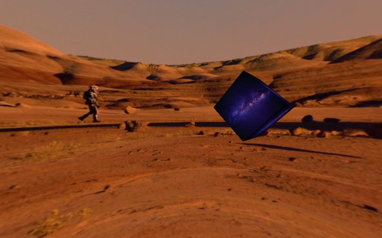
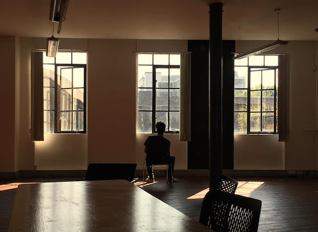

#   Virtual Reality Spaceship
###### A project by the Makers Academy Space Academy

***

### Mission

To use voice interaction (with Amazon's Alexa) to manipulate Virtual Reality.

### Crew
We're a team of four developers based in London, none of which had written a line of code 5 months ago. The Makers Academy Space Academy are:

- [Chief Engineer Calbayrac](https://github.com/gekographe)
- [Kate "beam-me-up" Gleeson](https://github.com/allbecauseyoutoldmeso)
- [Major Naz](https://github.com/nazwhale)
- [Lunar Module Pilot Odendaal](https://github.com/ruanodendaal)

### Use Instructions

To view our virtual reality experience, you can visit `www.spaceship-test.firebaseapp.com`.

On a mobile, place your phone inside a Google Cardboard VR headset (or similar) and tap the VR Goggles icon. With an Alexa with the Spaceship skill enabled, you can manipulate the VR view via voice commands. For example:
- "Alexa, ask Spaceship to take me to mars"
- "Alexa, ask Spaceship to make it rain"
- "Alexa, ask Spaceship to add Monolith"
- "Alexa, ask Spaceship to surprise me"
- "Alexa, ask Spaceship to tell me where I can go"

As our Alexa skill is not yet published, you will not yet be able to manipulate your VR experience with your own Alexa. However, if you go to our site on a desktop browser and open the console (`cmd+alt+i`), you can manually type in a variety of commands to manipulate the scene.

Here are a few you can try:
```
changeSky('#mars');
changeSky('#stratosphere');
changeSky('#orbit');
changeSky('#mars');
addMonolith();
removeMonolith();
addRain();
stopRain();
```

If you really want to give it a go with your own Alexa, we have included the code for the Spaceship skill in this repository. Feel free to create your own Alexa skill and use our code. To do so, you'll need to sign up with [Amazon Developers](https://developer.amazon.com/) and [AWS](https://aws.amazon.com/).

### User Stories
```
As an Intergalactic Tourist,
So that I can explore strange new worlds,
I would like to have an immersive VR experience of intergalactic environments.
```
```
As an Intergalactic Tourist,
So that I can have a more immersive VR experience,
I would like to be able to give voice commands to an Alexa Skill.
```
```
As an Intergalactic Tourist,
So that I can explore the frontiers of space,
I would like to have destinations available.
```
```
As an Intergalactic Tourist,
So that I can enjoy my VR experience at low cost,
I would like it to be available on Google Cardboard.
```
```
As a Space Developer,
So that my VR experience can be available to anyone,
I would like it to deploy it as a website.
```
```
As a Space Developer,
So that I can enhance my VR experience,
I would like to manipulate the reality I'm viewing.
```

### Technologies Used
- A-Frame
- Google Cardboard
- Amazon's Alexa
- AWS Lambda
- Firebase
- Jasmine
- JavaScript
- Node.js

### Log Book
#### Day 1
*Major Naz's log, stardate 22.5.2017* -
*Writing from the HMS Challenger.*

After arriving at Makers Academy HQ, the four of us gathered for a design sprint. We planned to interact with virtual reality using voice commands to Amazon's Alexa in order to transport the user to different planets. However, we first needed to clarify an MVP.

After a morning of constructive conversations reviewing our existing assumptions about VR and voice interaction, exploring as many possibilities as possible for our idea, then honing in on an MVP, we arrived at our mission statement: To switch VR views using voice commands to Alexa. Importantly, it must be sufficiently tested. Once this is satisfied, we can begin to fill those VR views will galactic environments from NASA's space rovers.

Next, we tried out [Google Cardboard](https://vr.google.com/cardboard/) and, after some thorough research including tutorials with [Google's standard developer kits for VR](https://developers.google.com/vr/cardboard/overview) and JJ managing to render a 360 degree photo in Google Cardboard, decided that an in-browser VR built in Unity with C# would be best suited to our mission. Certainly more technologies will be needed, but for now we have a place to start.

As none of us had any significant experience with Unity or C#, we set about educating ourselves by completing [Unity's roll-a-ball tutorial](https://unity3d.com/learn/tutorials/projects/roll-ball-tutorial). After, we plan to hack around in our Unity projects, adapting them for VR, then working on finding a way to switch between multiple VR views. Only once that is completed will we try and implement this functionality with Alexa.

Overall a very positive and productive day. We have a hell of a lot to do in 2 weeks, but spirits are high.

The earth looks mighty fine from up here.


#### Day 2
*Lunar Module Pilot Odendaal's log, stardate 23.5.2017* -
*Writing from the HMS Challenger.*

Building on our day 1 success we were all energized to dive a little deeper into VR. However after a good start we kept hitting blockers and our lack of experience in VR was becoming apparent. Post lunch we changed course and experiment with using [A-Frame](https://aframe.io) to build our VR model. Being built by the originators of WebVR and providing a clear structure to use `three.js`, we were starting to see immediate results.

By the end of the day we'd built a VR environment compatible with Google Cardboard that we can traverse!

 

A great end to a tough day, searching for our purpose...but we're one step closer.


#### Day 3
*Chief engineer Calbayrac's log, stardate 24.5.2017* -
*Writing from the HMS Challenger.*

A new day, a new adventure. Like every morning we gathered on the conference room to determine our strategies for the day. Our main focus is on Alexa, our new onboard Artificial Intelligence.

Even if it’s extremely powerful it is still fairly new and we are trying to find its limits. That’s why we tried by working in pairs to build different simple skills. After having fun creating a question game about video games, we started doing research to know how to link Alexa to our VR website experience.

One key thing came out this: we need to be able to update our website on the go. By the end of the day we moved to [Firebase](https://firebase.google.com/), a platform giving us the flexibility we were looking for. But we had to leave school to find refuge in an Alexa event.

Even if the talk was not quite what we hope for, we got the chance to ask the questions we were seeking answers for. And if it was not good enough a second talk about A-Frame (the 3D JavaScript framework we are using) was hosted at the same time. Major Naz went to attend this one while the rest of the crew stayed for the Alexa one.

Finally, I took the space shuttle to return to the mother base, looking at the sun disappearing in the distance, warm and safe.




#### Day 4
*Kate "beam-me-up" Gleeson's log, stardate 25.5.2017* -
*Writing from the HMS Challenger.*

On the fourth day of our voyage we found ourselves exploring unmapped frontiers in the form of Alexa and Firebase.  It was all a bit scary to say the least.

We already had the code to render our immersive interplanetary experience.  The next step was to teach Alexa to take the user to wherever said user asked.  Our intrepid coding team had attended talks, fired off emails, and interrogated every available expert, and concluded that Firebase might be the solution to the problem, functioning as an intermediary between AWS Lambda (the platform running our Alexa code) and the user’s device browser.

Today we split into two teams, tackling the problem from both ends (AWS Lambda and Firebase) and valiantly hoping that we would meet in the middle.  And so far it’s all going relatively well.

The mission continues…

#### Day 5
*Major Naz's log, stardate 26.5.2017* -
*Writing from the HMS Challenger.*

After splitting into two orbiting modules on day 4, both teams ventured into the deep space between AWS Lambda and Firebase, hoping to meet someday.

The Firebase team looked to edit our VR views using cURL requests from the command line. First a 'listener' was created using Firebase's 'messaging' functionality, and after a bit of tinkering, we managed to send it a signal via cURL. The listener listened and the view changed.

Later we looked to create the same effect via an HTTPS POST request from AWS Lambda. After some hard graft, we achieved this from the browser console. Later that evening, after a rocket fuel injection, Kate "beam-me-up" Gleeson managed to insert the code into AWS Lambda and specify the Alexa intents to change views. Finally sweet contact was made.

#### Day 6 - 7

*Chief engineer Calbayrac's log, stardate 29.5.2017* -
*Writing from the HMS Challenger.*

The voyage is coming to an end. After a short Saturday where we celebrated the newly reached MVP. We spent some time to listen to Kate as she walked us through the code she wrote to finally make our lovely Alexa teleport us to new worlds using only our sweet voices. After which we tried to pair and accomplish some work, but fatigue had caught up with us and we decided to break early.

Today we gathered to work on making the experience smoother on smartphone, and we were able to link an Android to Alexa.

Using the console of Kate’s Android phone we found the browser’s token and hardcoded it in the lambda function. Once done, Alexa had no difficulty to change the views of the different worlds we explored, including one populated with giants. While Kate "beam-me-up" Gleeson was doing that, Major Naz and I were adding new scenes and found the best way to do great VR pictures. Now you can visit the depths of the universe as well as our beautiful blue planet.

After lunch we were able, with the help of the database in Firebase, to save the token of every browser visiting our web app. It works perfectly with computers and Android phones but iPhones are still reluctant to share that piece of information with us. We tried many options but so far we still can’t get our hands on any iPhone's browser token.

We ended the day with a brainstorm on what the next steps could be. We are going to focus on the user experience, make sure that it’s easy for every user to enjoy our VR. For that, we are going to need to fetch browser token's, but how? We have a couple of good ways to test our app. It’s gonna be challenging but we live for that. We are Challengers!

#### Day 8
*Kate "beam-me-up" Gleeson's log, stardate 30.5.2017* -
*Writing from the HMS Challenger.*

With Alexa linked up to our code on Firebase, today we went into warp drive.  We added new features to Alexa in the morning, and in the afternoon started adding more interesting elements to our VR experience.  Before long our space odyssey had its very own monolith, capable of travelling to all corners of the universe in order to loom mysteriously.

Towards the end of the day, sadly, we got blocked by a single gnarly Jasmine test, and eventually had to admit temporary defeat.

Tomorrow, however, we will boldly venture onward.

#### Day 9
*Lunar Module Pilot Odendaal log, stardate 31.5.2017* -
*Writing from the HMS Challenger.*

After yesterdays temporary defeat we regrouped, had standup and came up with a new plan. Step one, eliminate the failing test. Chief engineer Calbayrac and I finally located the error and fixed it! This rejuvenated the crew and we were able to continue our voyage.

Step two, initiate addRain() from Alexa. Major Naz & Kate "beam-me-up" Gleeson integrated a new feature whilst refactoring that enabled us to control the weather on any planet we visited.

Lastly as a crew we upgraded our ship computer (Alexa). This meant configuring her to give us clearer responses that helped with the overall navigation experience.

Today gave us much joy and at the end we felt like we'd conquered the universe.
